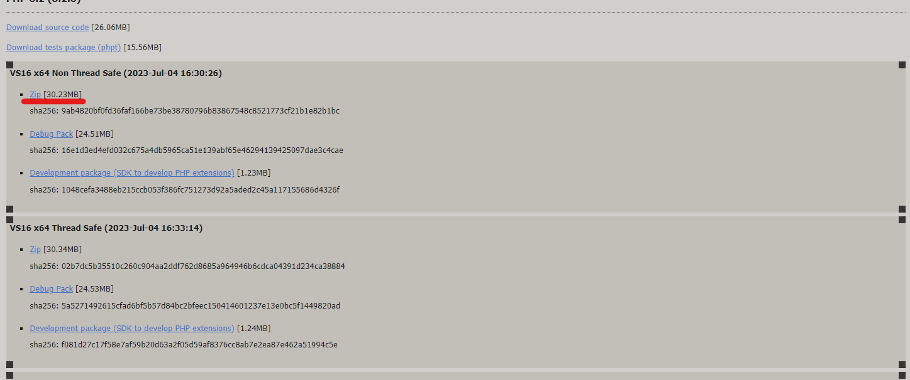
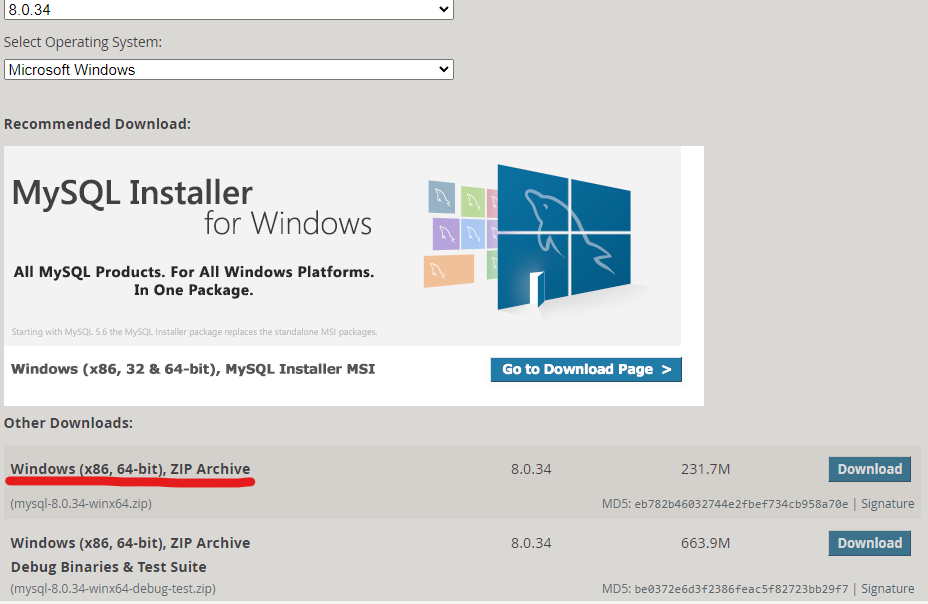

#### 全篇參考(https://codefaq.org/server/how-to-install-nginx-php-mysql-on-windows-10/)

# setup
1. 創立一個 ``webenvironment`` 資料夾
2. 裡面創 `nginx`,`php`,`mysql` 
3. 各自下載完，之後將資料夾放入
- [ ] nginx https://nginx.org/en/download.html
- [ ] php https://windows.php.net/download/

- [ ] mysql https://dev.mysql.com/downloads/mysql/

## 更改系統變量
- [ ] 設定/裝置規格-進階系統設定/進階-環境變量
- [ ] 進webenvironment 找所有環境變量(**#** **可執行檔存放的上一層資料夾名稱**)

### php
- [ ] 找尋 php.ini-production 改成 php.ini
- [ ] 修改php.ini 找尋   ``extension=/path/to/extension/mysqli.so`` 將其 取消註解
- [ ] 找尋 ``;extension_dir = "ext"`` => ``extension_dir = "F:\webenvironment\php\ext\"``
### mysql
- [ ] 設定完環境變量以後
```
mysqld -u root --initialize-insecure 
mysqld.exe -u root --console
```
自此 就會有mysql/data 資料夾 mysqld -v 就不會報錯了
### 檢查
- [ ] nginx -v **這個剛開始會有錯誤正常**
- [ ] mysqld -v
- [ ] php -v
### 建立batch 快速建置``mysql``,``php``,``nginx 環境``
建立myserver.bat(**# 放在nginx 環境變量資料夾中**)
```
@echo off
F:
cd \webenvironment\nginx\nginx-1.24.0


IF "%1" == "stop" (
	GOTO STOPSERVER
)else IF "%1" == "start" (
	GOTO STARTSERVER
)else (
	echo Use these commands:
	echo.
	echo myserver start
	echo myserver stop
)
GOTO END

:STARTSERVER
QPROCESS * | find /I /N "mysqld.exe">NUL
IF "%ERRORLEVEL%"=="0" (
	echo MYSQLD is already running.
)else (
	RunHiddenConsole.exe mysqld --console
	echo MYSQLD is now running.
)

QPROCESS * | find /I /N "nginx.exe">NUL
IF "%ERRORLEVEL%"=="0" (
	echo NGINX is already running.
)else (
	RunHiddenConsole.exe nginx
	echo NGINX is now running.
)

QPROCESS * | find /I /N "php-cgi.exe">NUL
IF "%ERRORLEVEL%"=="0" (
	echo PHP-CGI is already running.
)else (
	RunHiddenConsole.exe php-cgi -b 127.0.0.1:9000
	echo PHP-CGI is now running.
)

echo.
echo To stop, type "myserver stop"

GOTO END

:STOPSERVER

QPROCESS * | find /I /N "mysqld.exe">NUL
IF "%ERRORLEVEL%"=="0" (
	taskkill /F /IM mysqld.exe>NUL
	echo MYSQLD ended successfully.
)else (
	echo MYSQLD is not running
)

QPROCESS * | find /I /N "nginx.exe">NUL
IF "%ERRORLEVEL%"=="0" (
	::nginx -s stop
	taskkill /F /IM nginx.exe>NUL
	echo NGINX ended successfully.
)else (
	echo NGINX is not running
)

QPROCESS * | find /I /N "php-cgi.exe">NUL
IF "%ERRORLEVEL%"=="0" (
	taskkill /F /IM php-cgi.exe>NUL
	echo PHP-CGI ended successfully.
)else (
	echo PHP-CGI is not running
)

:END
```
RunHiddenConsole(https://redmine.lighttpd.net/attachments/660/RunHiddenConsole.zip)
也放在nginx 資料夾中
# ${workDirectory}/conf/nginx.conf 配置

## 單項配置
```
  server {
        listen       80;
        server_name  localhost;

        #charset koi8-r;

        #access_log  logs/host.access.log  main;

        location / {
            root   html;
            index  index.html index.htm;
        }

        #error_page  404              /404.html;

        # redirect server error pages to the static page /50x.html
        #
        error_page   500 502 503 504  /50x.html;
        location = /50x.html {
            root   html;
        }

        # proxy the PHP scripts to Apache listening on 127.0.0.1:80
        #
        #location ~ \.php$ {
        #    proxy_pass   http://127.0.0.1;
        #}

        # pass the PHP scripts to FastCGI server listening on 127.0.0.1:9000
        #
        #location ~ \.php$ {
        #    root           html;
        #    fastcgi_pass   127.0.0.1:9000;
        #    fastcgi_index  index.php;
        #    fastcgi_param  SCRIPT_FILENAME  /scripts$fastcgi_script_name;
        #    include        fastcgi_params;
        #}

        # deny access to .htaccess files, if Apache's document root
        # concurs with nginx's one
        #
        #location ~ /\.ht {
        #    deny  all;
        #}
    }

```
please commit location and make the configuration like this

```
server {`
        listen       80;
        server_name  localhost;

        #charset koi8-r;

        #access_log  logs/host.access.log  main;

        #location / {
        #    root   html;
        #    index  index.html index.htm;
        #}
        location / {
            index index.html index.htm index.php;
            try_files $uri $uri/ /index.php?$query_string;
        }
        #error_page  404              /404.html;

        # redirect server error pages to the static page /50x.html
        #
        error_page   500 502 503 504  /50x.html;
        location = /50x.html {
            root   html;
        }

        # proxy the PHP scripts to Apache listening on 127.0.0.1:80
        #
        #location ~ \.php$ {
        #    proxy_pass   http://127.0.0.1;
        #}

        # pass the PHP scripts to FastCGI server listening on 127.0.0.1:9000
        #
        #location ~ \.php$ {
        #    root           html;
        #    fastcgi_pass   127.0.0.1:9000;
        #    fastcgi_index  index.php;
        #    fastcgi_param  SCRIPT_FILENAME  /scripts$fastcgi_script_name;
        #    include        fastcgi_params;
        #}

        # deny access to .htaccess files, if Apache's document root
        # concurs with nginx's one
        #
        #location ~ /\.ht {
        #    deny  all;
        #}
    }

```

